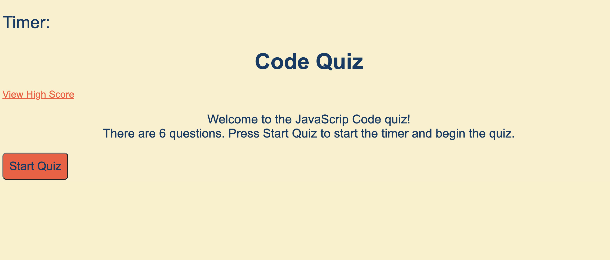
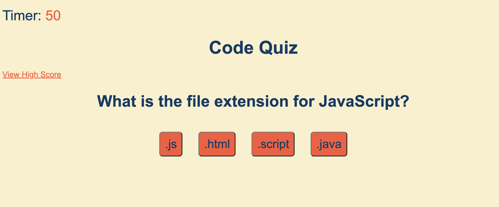
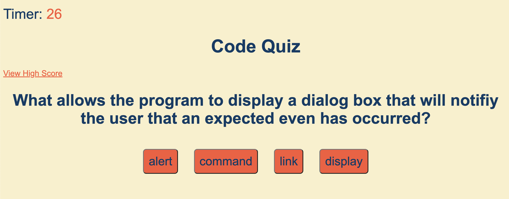
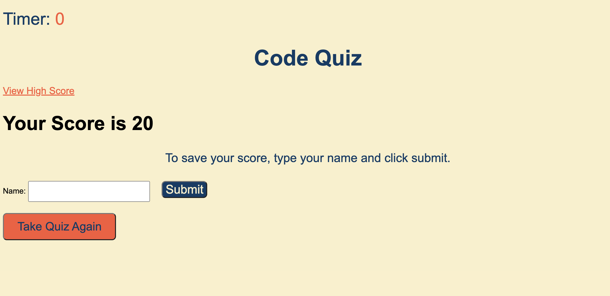
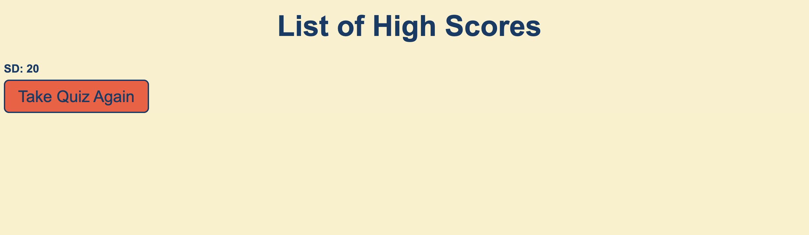

# Code Quiz

### Table of Contents
- [Description](#Description)
- [How to Use](#how-to-use)
- [Screenshots](#screenshots)
- [Sources](#sources)

## Description
This is an application that gives a quiz. When the start button is pressed, the first question shows and the timer starts. Questions and answers appear. The user can click on their answer. If the answer is correct, the next question appears. If the answer is incorrect, 10 seconds are deducted from the timer and the next question will appear. At the end of the quiz, the user can submit their name to the high scores. They can also retake the quiz or view the high scores.

## Screenshots
This is the main screen for the quiz.

Once the start quiz button is pressed, this page shows up.

Another page tht shows a question and timer that has decreased.

This is the end of quiz page where the user can submit their name to the high scores page. They can also retake the quiz.

This is the high score page.

## Sources
Created and designed by me. Click [whatawhat](www.github.com/whatawhat) to visit my repository.

